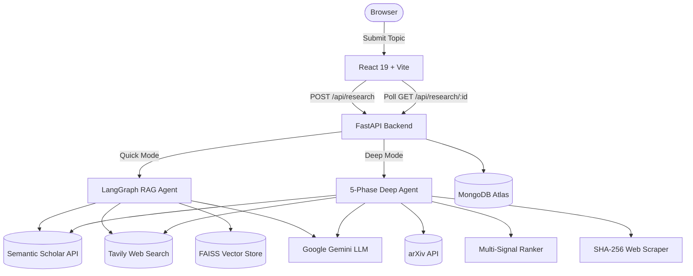

<div align="center">

# Deep Research Analysis

**An AI-powered, multi-phase research assistant that retrieves, ranks, verifies, and synthesizes information from academic papers and the web — in real time.**

[](https://python.org)
[](https://fastapi.tiangolo.com)
[](https://react.dev)
[](https://langchain-ai.github.io/langgraph/)
[](https://www.mongodb.com/atlas)
[](LICENSE)
[](CONTRIBUTING.md)
[](https://github.com/deepak8186863620/Deep_Research_Analysis/graphs/contributors)

[**Report a Bug**](https://github.com/deepak8186863620/Deep_Research_Analysis/issues/new?template=bug_report.md) · [**Request a Feature**](https://github.com/deepak8186863620/Deep_Research_Analysis/issues/new?template=feature_request.md) · [**How to Contribute**](CONTRIBUTING.md)

</div>

---

## What is This?

Deep Research Analysis is a full-stack web application that takes any research topic and produces a comprehensive, verified research report by querying multiple academic and web sources simultaneously. It supports two research modes:

- **Quick Mode** — A LangGraph reactive agent that iterates across Semantic Scholar, Tavily web search, and a task-isolated FAISS vector store to synthesize a report using Google Gemini.
- **Deep Mode** — A 5-phase pipeline that discovers sources from Semantic Scholar, arXiv, and Tavily; scrapes full web pages; cryptographically fingerprints every source with SHA-256; cross-verifies claims across sources with Gemini; and generates a fully cited, confidence-scored report.

---

## Implemented Features

| Feature | Description |
|---|---|
| **Quick Mode (LangGraph RAG)** | Reactive state graph: `START → agent → tools_condition → tools → agent → END`, up to 25 tool iterations |
| **Deep Mode (5-Phase Pipeline)** | Phase 1 Discover → Phase 2 Fetch & Fingerprint → Phase 3 Cross-Verify → Phase 4 Score → Phase 5 Report |
| **Multi-Source Discovery** | Semantic Scholar API · arXiv API · Tavily multi-angle web search |
| **FAISS Vector Search** | Task-isolated in-memory FAISS store, chunked via `RecursiveCharacterTextSplitter`, embedded with `all-MiniLM-L6-v2` |
| **Multi-Signal Paper Ranking** | Cross-encoder relevance (50%) + Citation impact (25%) + Recency (15%) + Source authority (10%) |
| **SHA-256 Source Fingerprinting** | Every source URL and paper abstract cryptographically hashed for tamper-evident verification |
| **Confidence Scoring** | Claims rated High (3+ sources) / Medium (2 sources) / Low (1 source) / Disputed (conflicting) |
| **Real-time Progress Streaming** | Live step-by-step progress (`progress_step`, `progress_details`) polled from MongoDB every 3 seconds |
| **Session History** | All research tasks persisted in MongoDB Atlas, accessible from the collapsible sidebar |
| **Markdown Export** | One-click copy to clipboard or download as `.md` file |
| **Dynamic Animated UI** | Unicorn Studio-style Canvas background with aurora orbs, starfield, floating particles, and mouse-reactive glow |

---

## Architecture



---

## Quick Start

### Prerequisites
- **Python** 3.10+
- **Node.js** 18+
- **MongoDB Atlas** URI (free tier works)
- API keys: [Google Gemini](https://aistudio.google.com/app/apikey) · [Tavily](https://app.tavily.com) · [Semantic Scholar](https://www.semanticscholar.org/product/api) *(optional but recommended)*

### 1. Clone
```bash
git clone https://github.com/deepak8186863620/Deep_Research_Analysis.git
cd Deep_Research_Analysis
```

### 2. Backend
```bash
cd backend
python -m venv venv
venv\Scripts\activate          # Windows
# source venv/bin/activate     # Mac / Linux

pip install -r requirements.txt
```

Create `backend/.env` (use `.env.example` as a reference):
```env
MONGODB_URI=mongodb+srv://<user>:<pass>@cluster.mongodb.net/deep_research
GOOGLE_API_KEY=your_gemini_api_key
TAVILY_API_KEY=your_tavily_api_key
SEMANTIC_SCHOLAR_API_KEY=your_ss_api_key   # optional but recommended
GEMINI_MODEL=gemini-2.0-flash
```

```bash
uvicorn app.main:app --reload
# API running at http://localhost:8000
```

### 3. Frontend
```bash
cd ../frontend
npm install
npm run dev
# App running at http://localhost:5173
```

---

## Project Structure

```
Deep_Research_Analysis/
├── backend/
│   ├── app/
│   │   ├── api/
│   │   │   └── research.py          ← GET/POST/DELETE /api/research endpoints
│   │   ├── core/
│   │   │   ├── config.py            ← Pydantic BaseSettings (loads .env)
│   │   │   └── database.py          ← Async Motor + MongoDB Atlas TLS connection
│   │   ├── models/
│   │   │   └── research.py          ← ResearchRequest & ResearchResponse schemas
│   │   ├── prompts/
│   │   │   └── research_prompts.py  ← Gemini prompt templates (4-step research + follow-up)
│   │   ├── services/
│   │   │   ├── research_agent.py        ← Quick Mode: LangGraph RAG agent
│   │   │   ├── deep_research_agent.py   ← Deep Mode: 5-phase verification pipeline
│   │   │   ├── semantic_scholar.py      ← Semantic Scholar API client
│   │   │   └── ranker.py                ← Multi-signal cross-encoder ranking
│   │   ├── utils/
│   │   │   └── text_utils.py        ← Text extraction, truncation, whitespace cleaning
│   │   └── main.py                  ← FastAPI app entry point + CORS + lifespan
│   ├── requirements.txt
│   ├── .env.example                 ← Template for environment variables
│   ├── faiss_demo.py                ← Standalone FAISS vector index demo
│   ├── test_agent.py                ← LangGraph agent integration test
│   ├── test_chunking.py             ← Semantic chunking unit test
│   └── test_gemini_api.py           ← Gemini API connectivity test
├── frontend/
│   ├── src/
│   │   ├── components/
│   │   │   ├── Sidebar.jsx           ← Collapsible nav + session history + status dots
│   │   │   ├── ParticleNetwork.jsx   ← Canvas particle-connection background
│   │   │   └── UnicornBackground.jsx ← Aurora orbs + starfield + mouse-reactive glow
│   │   ├── pages/
│   │   │   ├── HomePage.jsx          ← Hero input, topic chips, animated typewriter
│   │   │   └── ResearchPage.jsx      ← Live progress, report render, copy/download
│   │   ├── services/
│   │   │   └── api.js                ← REST client (list, create, get, delete, health)
│   │   └── styles/
│   │       ├── index.css             ← Global design tokens, HSL dark theme, animations
│   │       ├── App.css               ← App grid shell, top bar, offline badge
│   │       ├── HomePage.css          ← Hero layout, chip buttons, input card
│   │       ├── ResearchPage.css      ← Status pills, progress logs, markdown styling
│   │       └── Sidebar.css           ← Sidebar drawer, status dots, hover effects
│   ├── index.html
│   └── package.json
├── docs/
│   └── CODEBASE_DOCUMENTATION.md    ← Full architectural + inter-file reference
├── WorkingOfRankingAlgorithm.ipynb  ← Jupyter notebook explaining the ranking algorithm
├── CONTRIBUTING.md
└── LICENSE
```

---

## Ranking Algorithm

The multi-signal ranker in [`backend/app/services/ranker.py`](backend/app/services/ranker.py) scores each paper by combining four independent signals:

| Signal | Weight | Method |
|---|---|---|
| **Relevance** | 50% | `cross-encoder/ms-marco-MiniLM-L-6-v2` — query × abstract pair scoring via HuggingFace |
| **Citation Impact** | 25% | Log-normalized citation count (handles power-law distribution) |
| **Recency** | 15% | Linear decay over a 10-year window |
| **Source Authority** | 10% | Semantic Scholar = 1.0 · arXiv = 0.7 · Web = 0.4 |

See [`WorkingOfRankingAlgorithm.ipynb`](WorkingOfRankingAlgorithm.ipynb) for a detailed walkthrough with visualizations.

---

## API Endpoints

| Method | Endpoint | Description |
|---|---|---|
| `GET` | `/health` | Backend liveness check |
| `GET` | `/api/research/` | List recent research tasks (newest first) |
| `POST` | `/api/research/` | Create a new research task (`quick` or `deep` mode) |
| `GET` | `/api/research/{task_id}` | Poll task status, live progress, and completed report |
| `DELETE` | `/api/research/{task_id}` | Remove a task from MongoDB |

### Request Payload (`POST /api/research/`)
```json
{
  "topic": "Transformer attention mechanisms in LLMs",
  "instructions": "Focus on recent papers from 2023-2025",
  "mode": "deep"
}
```

---

## Technology Stack

**Backend:** Python 3.10+ · FastAPI · LangGraph · LangChain · Google Gemini (`gemini-2.0-flash`) · FAISS (in-memory) · `sentence-transformers` (`all-MiniLM-L6-v2`, `ms-marco-MiniLM-L-6-v2`) · MongoDB Atlas (Motor async driver) · Tavily Search · arXiv API · Semantic Scholar API · Pydantic

**Frontend:** React 19 · Vite · Framer Motion · `react-markdown` · Vanilla CSS · HTML5 Canvas API

---

## Contributing

**We actively welcome contributions!** Whether it is fixing a bug, adding a feature, or improving docs — every PR counts.

Read [CONTRIBUTING.md](CONTRIBUTING.md) to get started.

### Good First Issues
- [ ] Add unit tests for `ranker.py` signal functions
- [ ] Dark / light theme toggle
- [ ] Export results as PDF or DOCX
- [ ] Rate-limit handling with exponential backoff for Semantic Scholar
- [ ] Abstract language detection (non-English filtering)
- [ ] Streaming LLM responses via Server-Sent Events (SSE)
- [ ] Pagination for sidebar task history

---

## License

MIT License — see [LICENSE](LICENSE) for details.

---

## Authors

Built by [**Deepak Prajapati**](https://github.com/deepak8186863620) & **Nishanth**

---

<div align="center">

**Star this repo if you find it useful — it helps more people discover the project!** ⭐

</div>
