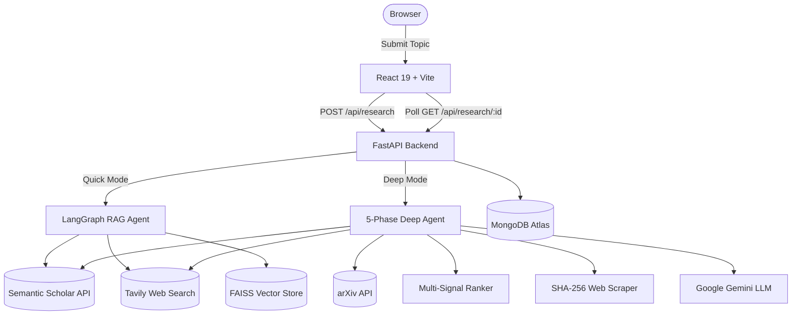

<div align="center">

# Deep Research Analysis

**An AI-powered, multi-phase research assistant that retrieves, ranks, verifies, and synthesizes information from academic papers and the web — in real time.**

[](https://python.org)
[](https://fastapi.tiangolo.com)
[](https://react.dev)
[](LICENSE)
[](CONTRIBUTING.md)
[](https://github.com/deepak8186863620/Deep_Research_Analysis/graphs/contributors)

[**Report a Bug**](https://github.com/deepak8186863620/Deep_Research_Analysis/issues/new?template=bug_report.md) · [**Request a Feature**](https://github.com/deepak8186863620/Deep_Research_Analysis/issues/new?template=feature_request.md) · [**How to Contribute**](CONTRIBUTING.md)

</div>

---

## Key Features

| Feature | Description |
|---|---|
| **Quick Mode** | LangGraph RAG loop — Semantic Scholar + Tavily + FAISS vector search |
| **Deep Mode** | 5-phase pipeline: Discover → Fetch → Verify → Score → Report |
| **Multi-Signal Ranking** | Cross-encoder relevance (50%) + Citation impact (25%) + Recency (15%) + Authority (10%) |
| **SHA-256 Verification** | Every source is cryptographically fingerprinted |
| **Confidence Scoring** | Claims rated High / Medium / Low / Disputed across independent sources |
| **PDF + Markdown Export** | One-click export with a branded cover page |
| **Real-time Progress** | Live step-by-step progress streamed to the UI |
| **Session History** | All research tasks stored and accessible from the sidebar |

---

## Architecture



---

## Quick Start

### Prerequisites
- **Python** 3.10+
- **Node.js** 18+
- **MongoDB Atlas** URI (free tier works)
- API keys: [Google Gemini](https://aistudio.google.com/app/apikey) · [Tavily](https://app.tavily.com) · [Semantic Scholar](https://www.semanticscholar.org/product/api) *(optional)*

### 1. Clone
```bash
git clone https://github.com/deepak8186863620/Deep_Research_Analysis.git
cd Deep_Research_Analysis
```

### 2. Backend
```bash
cd backend
python -m venv venv
venv\Scripts\activate          # Windows
# source venv/bin/activate     # Mac / Linux

pip install -r requirements.txt
```

Create `backend/.env`:
```env
MONGODB_URI=mongodb+srv://<user>:<pass>@cluster.mongodb.net/deep_research
GOOGLE_API_KEY=your_gemini_api_key
TAVILY_API_KEY=your_tavily_api_key
SEMANTIC_SCHOLAR_API_KEY=your_ss_api_key   # optional but recommended
GEMINI_MODEL=gemini-2.0-flash
```

```bash
uvicorn app.main:app --reload
# API running at http://localhost:8000
```

### 3. Frontend
```bash
cd ../frontend
npm install
npm run dev
# App running at http://localhost:5173
```

---

## Project Structure

```
Deep_Research_Analysis/
├── backend/
│   ├── app/
│   │   ├── api/            # FastAPI route handlers
│   │   ├── core/           # Config + MongoDB connection
│   │   ├── models/         # Pydantic schemas
│   │   ├── prompts/        # Gemini prompt templates
│   │   ├── services/
│   │   │   ├── ranker.py           <- multi-signal ranking algorithm
│   │   │   ├── deep_research_agent.py
│   │   │   ├── research_agent.py
│   │   │   └── semantic_scholar.py
│   │   └── utils/
│   └── requirements.txt
├── frontend/
│   ├── src/
│   │   ├── components/     # Sidebar, ParticleNetwork
│   │   ├── pages/          # HomePage, ResearchPage
│   │   ├── services/       # api.js REST client
│   │   └── styles/         # CSS design system
│   └── package.json
└── docs/
    └── CODEBASE_DOCUMENTATION.md
```

---

## Ranking Algorithm

The multi-signal ranker in [`backend/app/services/ranker.py`](backend/app/services/ranker.py) combines four signals:

| Signal | Weight | Method |
|---|---|---|
| **Relevance** | 50% | `cross-encoder/ms-marco-MiniLM-L-6-v2` — query x abstract pair scoring |
| **Citation Impact** | 25% | Log-normalized citation count (power-law friendly) |
| **Recency** | 15% | Linear decay over 10-year window |
| **Source Authority** | 10% | Semantic Scholar = 1.0 · arXiv = 0.7 · Web = 0.4 |

---

## Contributing

**We actively welcome contributions!** Whether it is fixing a bug, adding a feature, or improving docs — every PR counts.

Read [CONTRIBUTING.md](CONTRIBUTING.md) to get started.

### Good First Issues
- [ ] Add unit tests for `ranker.py` signal functions
- [ ] Dark/light theme toggle
- [ ] Export results as DOCX
- [ ] Rate-limit handling with exponential backoff for Semantic Scholar
- [ ] Abstract language detection (non-English filtering)
- [ ] Streaming LLM responses via SSE

### Tech Stack
`Python` · `FastAPI` · `LangGraph` · `LangChain` · `sentence-transformers` · `FAISS` · `React 19` · `Vite` · `Framer Motion` · `MongoDB`

---

## Technology Stack

**Backend:** Python · FastAPI · LangGraph · LangChain · Google Gemini · FAISS · Sentence Transformers · MongoDB (Motor) · Tavily · arXiv

**Frontend:** React 19 · Vite · Framer Motion · React Markdown · Vanilla CSS

---

## License

MIT License — see [LICENSE](LICENSE) for details.

---

## Authors

Built by [**Deepak Prajapati**](https://github.com/deepak8186863620) & **Nishanth**

---

<div align="center">

**Star this repo if you find it useful — it helps more people discover the project!**

</div>