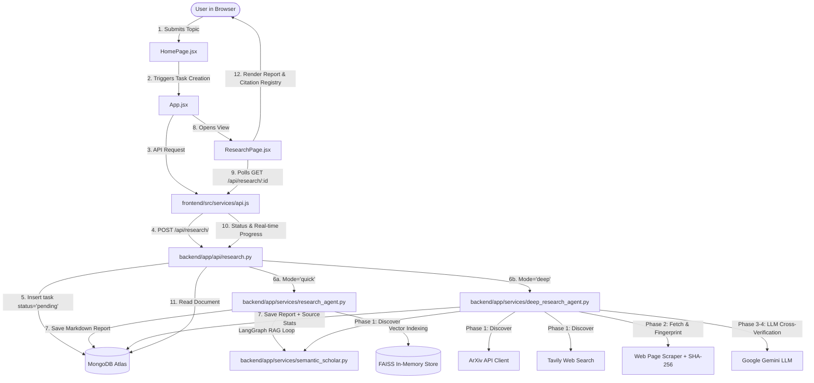

# Deep Research Analysis — Architectural & Codebase Documentation

This document provides a complete, accurate reference for the **Deep Research Analysis** project codebase. It details the functionality of every folder, file, and the connections between backend and frontend modules.

---

## 🏗️ High-Level System Architecture

---

## 📁 Directory & File Functionality Breakdown

### 1. Root Directory (`/`)
* **`.gitignore`**: Specifies files and directories ignored by version control (e.g., `node_modules`, `.venv`, `.env`, `dist`, `__pycache__`).
* **`README.md`**: Project overview detailing features, requirements, environment setup, and start commands for both frontend and backend.
* **`backend/`**: Python FastAPI application housing research agents, data models, database connections, API endpoints, prompt templates, and utility services.
* **`frontend/`**: Vite + React single-page frontend application featuring interactive animations, real-time research task polling, markdown synthesis rendering, and session history management.
* **`docs/`**: Directory reserved for project documentation artifacts.

---

### 2. Backend Architecture (`backend/`)

#### Root Files (`backend/`)
* **`requirements.txt`**: Defines backend Python dependencies including `fastapi`, `uvicorn`, `pydantic-settings`, `motor` (async MongoDB driver), `google-genai`, `langchain-google-genai`, `langchain-tavily`, `faiss-cpu`, `sentence-transformers`, `arxiv`, `requests`, and `certifi`.
* **`.env`**: Stores sensitive API keys and configuration settings (`MONGODB_URI`, `GOOGLE_API_KEY`, `TAVILY_API_KEY`, `SEMANTIC_SCHOLAR_API_KEY`, `GEMINI_MODEL`).
* **`faiss_demo.py`**: Standalone script demonstrating FAISS vector index construction, chunk embedding via HuggingFace transformers, and vector similarity search.
* **`test_agent.py`**: Integration test script for verifying LangGraph agent execution and search tools outside the FastAPI HTTP server.
* **`test_chunking.py`**: Test script verifying semantic chunking rules (`RecursiveCharacterTextSplitter`) on sample research papers.
* **`test_gemini_api.py`**: Standalone script checking Google Gemini API connection and model responses.
* **`sample_paper.txt`**: Benchmark sample dataset used by test scripts for testing parsing, chunking, and embedding logic.

---

#### Application Core Package (`backend/app/`)

##### Entrypoint & Routers
* **`app/main.py`**: FastAPI entry point. Sets up application lifespan events (`connect_to_mongo` on startup, `close_mongo_connection` on shutdown), configures CORS middleware for frontend origin ports (`http://localhost:5173`, `3000`), mounts the `/api/research` router, and provides `/` and `/health` status check endpoints.
* **`app/api/research.py`**: Defines HTTP endpoints under `/api/research`:
  * `GET /api/research/`: Returns the list of recent research tasks (sorted newest first) for sidebar history.
  * `POST /api/research/`: Receives `ResearchRequest` payloads, creates a `pending` research document in MongoDB, triggers an asynchronous background worker (`run_research_task` for quick mode or `run_deep_research_task` for deep mode), and returns a `ResearchResponse`.
  * `GET /api/research/{task_id}`: Serves current execution status, live progress logs (`progress_step`, `progress_details`), and completed markdown reports.
  * `DELETE /api/research/{task_id}`: Removes a research task record from MongoDB.

---

##### Core System & Settings (`backend/app/core/`)
* **`app/core/config.py`**: Centralized settings class using Pydantic `BaseSettings`. Loads environment variables from `.env` (`MONGODB_URI`, `GOOGLE_API_KEY`, `TAVILY_API_KEY`, `SEMANTIC_SCHOLAR_API_KEY`, `GEMINI_MODEL`).
* **`app/core/database.py`**: Asynchronous MongoDB database manager using `motor`. Configures Python 3.13 + MongoDB Atlas TLS contexts via `certifi` CA bundles (`_make_ssl_context`), initializes connection (`connect_to_mongo`), surfaces connectivity errors on startup, and exports `get_database()`.

---

##### Data Schemas (`backend/app/models/`)
* **`app/models/research.py`**: Pydantic models for HTTP request and response payload validation:
  * `ResearchRequest`: Validates incoming request parameters (`topic`, optional `instructions`, `mode`: `"quick"` or `"deep"`).
  * `ResearchResponse`: Defines task creation responses containing task `id`, `topic`, `status`, `mode`, and timestamp.

---

##### Prompt Engineering Store (`backend/app/prompts/`)
* **`app/prompts/research_prompts.py`**: Stores structured prompt templates for Gemini LLM:
  * `build_research_prompt()`: Generates a 4-step prompt (Step 1 Academic Research, Step 2 Current Web Research, Step 3 Cross-Source Comparison, Step 4 Final Report Structure).
  * `build_followup_prompt()`: Constructs prompts for answering follow-up queries using pre-indexed FAISS papers.

---

##### AI Agents & Services (`backend/app/services/`)
* **`app/services/research_agent.py`**: Executes **Quick Mode** research tasks using a **LangGraph** reactive state graph:
  * Initializes `llm` (`ChatGoogleGenerativeAI`), `embeddings` (`all-MiniLM-L6-v2`), and `text_splitter` (`RecursiveCharacterTextSplitter`).
  * `_build_research_tools()`: Dynamically instantiates 3 isolated tools per research task: `tavily_tool` (web search), `search_semantic_scholar` (fetches peer-reviewed papers, chunks abstracts, and populates a task-isolated FAISS vector store), and `search_indexed_papers` (performs vector similarity retrieval against FAISS chunks).
  * `run_research_task()`: Main background task function compiling the state graph (`START → agent → tools_condition → tools → agent → END`), running up to 25 tool execution iterations, extracting the final report text, and writing results to MongoDB.

* **`app/services/deep_research_agent.py`**: Executes **Deep Mode** multi-phase verification research tasks:
  * **Phase 1 (Discover)**: Queries Semantic Scholar (`_fetch_semantic_scholar`), arXiv (`_fetch_arxiv`), and Tavily multi-angle search (`_fetch_tavily_multi`). Generates SHA-256 cryptographic fingerprints (`_sha256`) for every discovered source.
  * **Phase 2 (Fetch)**: Scrapes full HTML text from web pages (`_fetch_web_page`, `_strip_html`), calculating word counts and SHA-256 hashes.
  * **Phase 3 & 4 (Verify & Score)**: Constructs a source digest and invokes Gemini (`_verify_and_score`) to cross-check factual claims across sources, assigning confidence scores (High: 3+ sources, Medium: 2 sources, Low: 1 source, Disputed: conflicting sources) and an overall confidence percentage.
  * **Phase 5 (Report)**: Renders the final verified markdown report featuring a complete SHA-256 source verification registry table and streams real-time progress updates (`progress_step`, `progress_details`) to MongoDB during execution.

* **`app/services/semantic_scholar.py`**: Low-level service interface for the Semantic Scholar API:
  * `_get()`: Centralized HTTP request helper managing rate-limiting headers and timeouts.
  * `search_papers()`: Fetches academic papers matching keywords, sorted descending by citation count.
  * `fetch_full_text()`: Retrieves full paper text via arXiv API or falls back to paper abstracts.
  * `get_paper_details()`: Retrieves detailed metadata (authors, citation count, TLDR, references).
  * `get_references()`: Fetches cited paper lists to enable citation chaining research workflows.

* **`app/services/ranker.py`**: Multi-signal scoring and ranking pipeline:
  * Signal calculation functions: `citation_score()` (log-normalized citation impact), `recency_score()` (linear age decay over 10 years), and `authority_score()` (Semantic Scholar = 1.0, arXiv = 0.7, Web = 0.4).
  * HuggingFace Cross-Encoder loader (`_load_model()`, loading `cross-encoder/ms-marco-MiniLM-L-6-v2`) for semantic query-document relevance scoring (`relevance_scores()`, `rank_papers()`).

---

##### Helper Utilities (`backend/app/utils/`)
* **`app/utils/text_utils.py`**: Text processing helpers shared across the app:
  * `extract_text_from_message()`: Safely extracts string text from standard strings or multi-part content block lists returned by LLM messages.
  * `truncate_text()`: Shortens long text strings safely for logging or MongoDB storage.
  * `clean_whitespace()`: Normalizes whitespace, tabs, and newlines in scraped abstracts and web pages.
  * `format_paper_citation()`: Formats paper citation strings `[Title, Year — N citations]`.

* **`backend/app/agents/`** & **`backend/app/graph/`**: Packages reserved for autonomous sub-agent modules and LangGraph flow definitions (`__init__.py`).

---

### 3. Frontend Architecture (`frontend/`)

#### Configuration & Build (`frontend/`)
* **`package.json`**: Frontend Node project file specifying dependencies (`react`, `react-dom`, `framer-motion`, `react-markdown`, `vite`).
* **`vite.config.js`**: Vite configuration file defining dev server options and build settings.
* **`index.html`**: Entry HTML template mounting `#root` and embedding Google Fonts.
* **`.oxlintrc.json`**: Linter configuration for Oxlint.

---

#### Application Source Code (`frontend/src/`)

##### Root Component & Main Entry
* **`src/main.jsx`**: React root mount point. Renders `App` inside `React.StrictMode` into `#root`.
* **`src/App.jsx`**: Main application shell and global state manager:
  * Tracks top-level state: `sidebarOpen`, `currentTask` (active task), `history` (list of session tasks), `isLoading`, and `backendOk` (backend status flag).
  * Performs initial server check (`checkHealth()`) and fetches task history (`listResearchTasks(30)`).
  * Controls view transitions using Framer Motion (`AnimatePresence`) switching between `HomePage` and `ResearchPage`.
  * Implements task management handlers: `handleSubmit()` (creates task via API and switches view), `handleSelectTask()`, `handleDeleteTask()`, and `handleTaskUpdate()`.

---

##### API Communication Client (`frontend/src/services/`)
* **`src/services/api.js`**: Centralized REST API client using `fetch`:
  * `listResearchTasks(limit)`: Calls `GET /api/research/?limit=${limit}` to fetch recent tasks for history.
  * `createResearchTask(topic, instructions, mode)`: Calls `POST /api/research/` to submit a research job.
  * `getResearchTask(taskId)`: Calls `GET /api/research/${taskId}` to poll task progress and results.
  * `deleteResearchTask(taskId)`: Calls `DELETE /api/research/${taskId}` to remove a task.
  * `checkHealth()`: Calls `GET /health` to verify backend status.

---

##### UI Components (`frontend/src/components/`)
* **`src/components/Sidebar.jsx`**: Collapsible navigation sidebar. Renders navigation links (Research, Explore, Library), task history list with real-time status dots (completed, processing, pending, failed), delete task buttons, "New Research" action button, and user profile drawer ("Deepak").
* **`src/components/ParticleNetwork.jsx`**: Interactive HTML5 Canvas animation component. Simulates 80 floating background particles connected by proximity distance vectors and dynamic mouse interaction lines.

---

##### Page Views (`frontend/src/pages/`)
* **`src/pages/HomePage.jsx`**: Landing view layout. Contains hero greeting header ("Let's start, Exploring"), suggestion topic chips (CRISPR, LLMs, Climate Change, Quantum Computing, mRNA), topic textarea input, custom instructions toggle drawer, model selection badge ("Deep Research"), and submit trigger button.
* **`src/pages/ResearchPage.jsx`**: Interactive research dashboard:
  * Polls `getResearchTask(taskId)` every 3 seconds while task status is `pending` or `processing`.
  * Renders live elapsed time counter and step progress indicators (`progress_step`, `progress_details` displaying fetched academic papers and web URLs count).
  * Renders completed research reports formatted as rich GitHub Markdown using `ReactMarkdown`.
  * Action toolbar: "Copy" markdown report to clipboard, "Download" as `.md` file, and "+ New Research".

---

##### Design System & Styles (`frontend/src/styles/`)
* **`HomePage.css`**: Layout, typography, chip buttons, model selection badge, and input card styles for the home view.
* **`ResearchPage.css`**: Header topic badges, status pills, pulse animations, live progress logs, and markdown styling (tables, lists, blockquotes, code blocks).
* **`Sidebar.css`**: Styles for the sidebar drawer, item hover effects, active state indicators, status dots, and transition animations.
* **`App.css`**: App grid shell, top bar header layout, backend offline badge, and responsive rules.
* **`index.css`**: Global design tokens (HSL dark theme color variables, glassmorphism filters, scrollbars, keyframe animations).

---

## 🔗 Complete Inter-File Connection Matrix

| Source File / Module | Dependent Target Module | Connection Type & Purpose |
| :--- | :--- | :--- |
| **`app/main.py`** | `app/core/database.py` | Lifecycle hook: connects/disconnects MongoDB Atlas |
| **`app/main.py`** | `app/api/research.py` | Mounts `/api/research` APIRouter onto FastAPI app |
| **`app/api/research.py`** | `app/core/database.py` | Obtains MongoDB database instance (`get_database()`) |
| **`app/api/research.py`** | `app/models/research.py` | Uses `ResearchRequest` & `ResearchResponse` for payload validation |
| **`app/api/research.py`** | `app/services/research_agent.py` | Dispatches `run_research_task` in background for Quick mode |
| **`app/api/research.py`** | `app/services/deep_research_agent.py` | Dispatches `run_deep_research_task` in background for Deep mode |
| **`app/services/research_agent.py`** | `app/core/config.py` | Loads `GOOGLE_API_KEY`, `TAVILY_API_KEY`, `GEMINI_MODEL` |
| **`app/services/research_agent.py`** | `app/prompts/research_prompts.py` | Calls `build_research_prompt(topic, instructions)` |
| **`app/services/research_agent.py`** | `app/utils/text_utils.py` | Calls `extract_text_from_message()` and `clean_whitespace()` |
| **`app/services/deep_research_agent.py`** | `app/utils/text_utils.py` | Uses `clean_whitespace()` to normalize scraped text |
| **`app/services/deep_research_agent.py`** | `app/core/database.py` | Updates task document, `progress_step`, and `progress_details` |
| **`app/services/semantic_scholar.py`** | `app/core/config.py` | Uses `SEMANTIC_SCHOLAR_API_KEY` for authenticated requests |
| **`src/App.jsx`** | `src/services/api.js` | Calls `checkHealth()`, `listResearchTasks()`, `createResearchTask()`, `deleteResearchTask()` |
| **`src/App.jsx`** | `src/components/Sidebar.jsx` | Passes history list, task selection, deletion, and toggle callbacks |
| **`src/App.jsx`** | `src/pages/HomePage.jsx` | Renders landing page view and passes `handleSubmit()` callback |
| **`src/App.jsx`** | `src/pages/ResearchPage.jsx` | Renders active task dashboard and handles task updates |
| **`src/pages/ResearchPage.jsx`** | `src/services/api.js` | Periodically calls `getResearchTask(taskId)` for polling |
